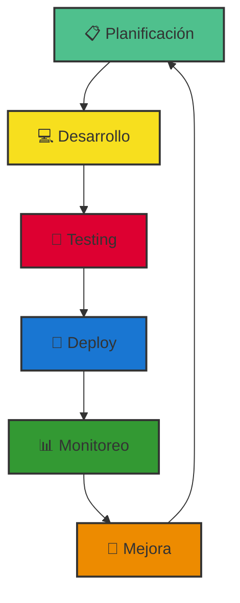

<div align="center">

# 👨‍💻 Andrés Aguirre

### `Full Stack Developer` | `Problem Solver` | `Continuous Learner`

[](https://www.linkedin.com/in/andr%C3%A9s-aguirre-restrepo-819ba1163/)
[](mailto:Andresag1220@gmail.com)
[](https://wa.me/573148283034)

```ascii
╔══════════════════════════════════════════════════════════════════╗
║  "Transformando ideas en soluciones digitales funcionales"      ║
╚══════════════════════════════════════════════════════════════════╝
```

</div>

---

## 🎯 Sobre Mí

```typescript
const developer = {
  name: "Andrés Aguirre",
  role: "Full Stack Developer",
  company: "Cubit Syc",
  location: "Rionegro, Antioquia, Colombia",
  
  passions: {
    code: ["Clean Architecture", "Best Practices", "Scalable Solutions"],
    learning: ["New Technologies", "Design Patterns", "Performance Optimization"],
    mindset: "Always improving, always learning"
  },
  
  currentFocus: [
    "Building robust web applications",
    "Exploring modern JS frameworks",
    "Optimizing database performance"
  ]
};
```

Desarrollador de software apasionado por crear **soluciones web funcionales y bien estructuradas**. Mi enfoque está en desarrollar aplicaciones que no solo funcionen, sino que sean mantenibles, escalables y alineadas con objetivos reales del negocio.

---

## 💼 Experiencia Profesional

<table>
<tr>
<td width="30%"><strong>🏢 Empresa</strong></td>
<td width="70%">Cubit Syc</td>
</tr>
<tr>
<td><strong>👨‍💻 Rol</strong></td>
<td>Programador de Software</td>
</tr>
<tr>
<td><strong>🎯 Alcance</strong></td>
<td>Desarrollo integral de aplicaciones web: diseño, implementación y optimización</td>
</tr>
</table>

### 🔧 Responsabilidades Clave

```yaml
desarrollo_web:
  - Creación de sitios web personalizados con WordPress y Divi
  - Desarrollo de aplicaciones SPA con Vue.js y Angular
  - Implementación de APIs REST con Node.js y Sails.js
  
optimización:
  - Mejora de rendimiento y velocidad de carga
  - Refactorización de código legacy
  - Implementación de mejores prácticas de seguridad
  
bases_de_datos:
  - Diseño y normalización de esquemas SQL
  - Optimización de queries complejas
  - Gestión de migraciones y backups
```

---

## 🛠️ Stack Tecnológico

<div align="center">

### 💻 Lenguajes

```
╔═══════════╦═══════════╦═══════════╦═══════════╗
║    C++    ║   Java    ║JavaScript ║  Python   ║
╠═══════════╬═══════════╬═══════════╬═══════════╣
║  ████████ ║  ████████ ║  █████████║  ███████  ║
╚═══════════╩═══════════╩═══════════╩═══════════╝
```

</div>

<table>
<tr>
<td width="33%" valign="top">

### 🎨 Frontend


</td>
<td width="33%" valign="top">

### ⚙️ Backend


**Frameworks:**
- Express.js
- REST APIs
- MVC Architecture

</td>
<td width="33%" valign="top">

### 💾 Databases


**Habilidades:**
- Diseño de esquemas
- Query optimization
- Data modeling

</td>
</tr>
</table>

---

### 🚀 Proyectos Web
> Aplicaciones funcionales que demuestran habilidades full stack

- **SPAs con Vue.js**: aplicaciones reactivas y componentes reutilizables
- **APIs RESTful**: servicios backend escalables y documentados
- **Integraciones**: conexión con servicios externos y bases de datos
---

## 📈 Filosofía de Desarrollo

<div align="center">



</div>


## 🤝 Colaboración y Contacto

<div align="center">

```
╔════════════════════════════════════════════════════════════╗
║                                                            ║
║  💬 Siempre abierto a nuevas oportunidades                ║
║  🤝 Colaboraciones en proyectos interesantes              ║
║  📚 Compartir conocimiento y experiencias                 ║
║  ☕ Charlar sobre tecnología y desarrollo                 ║
║                                                            ║
╚════════════════════════════════════════════════════════════╝
```

### 📫 ¿Cómo contactarme?

Si tienes un proyecto interesante, quieres colaborar o simplemente charlar sobre desarrollo, ¡no dudes en contactarme!

**Respondo rápido a:** `LinkedIn` • `Email: Andresag1220@gmail.com` • `WhatsApp: +57 314 828 3034`

</div>


⭐️ **Gracias por visitar mi perfil** | Made with ❤️ by Andrés Aguirre

</div>
